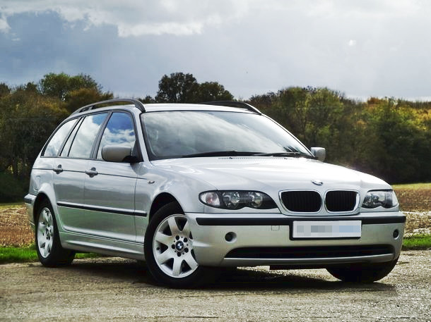

## Základné údaje

**Predajná cena:** 3900 EUR

- Výkon 110 kW (150 PS)
- Automatická prevodovka (5-stupňová)
- Zadný pohon
- Objem motoru 1995 cm³ (2 l)
- Strieborná metalíza
- **Rok výroby:** 2003
- **Najazdené:** 280000 km
- 4-dverové, 5-miestne

## Náklady na prevádzku auta

## Bezpečnosť
- ABS, ASR, DSC
- airbag spolujazdca, vodiča, okenné
- centrálne zamykanie

## Komfort
- original BMW palubá doska s rádiom + kazetovým prehrávačom + USB (cez kazetu)
- automatická klimatizácia
- posilňovač riadenia
- vyhrievané predné sedadlá
- elektrické okná 4x
- elektrické zrkadlá
- tónované predné sklá
- tmavé fólie na zadných oknách
- lakťová opierka

## Ďalšia výbava
- odnímateľná deliaca mreža
- letné hliníkové disky orig. BMW
- pomerne nové letné gumy Michelin (cca 15000 km)
- zimné metalické disky + orig. BMW puklice
- zimné pneu na približne jednu sezónu
- zimné hmlovky
- stojan pre mobil ako navigáciu
- digitalny merač tlaku

## Pravdepodobné opravy za 2 roky
- tlmiče, pružiny - bežná údržba
- brzdové doštičky - bežná údržba
- olej, náplň klimatizácie - bežná údržba
- turbo od začiatku mierne píska - možný repas turba (300-500 EUR)
- možno nová batéria (keď nie je dostatočne nabitá, funguje len manualne zamykanie, vtedy je potrebné naštartovať a po chvíli sa batéria dobije)
- vymena tesnenia na posilovači bŕzd (300-450 EUR)
- senzor v sedadle spolujazdca, na základe ktorého svieti kontrolka airbagu (airbag funguje, len kontrolka stale svieti, 100-250 EUR)
- spätné zrkadlá sa nikdy nedali sklopiť

## Údržba vozidla + kalendár opráv

- parkované v podzemnej garáži
- pravidelné vymeny oleja / filtrov každých 10000-12000 km
- každé dva roky výmena chladiacej kvapaliny do klimatizácie (naposledy 2015)
- STK každé dva roky (naposledy 2015/04)
- ročná poistka na auto stojí 163 EUR
- tankovaný premium diesel + aditivum (Super Diesel Aditiv)

### rok 2011 (195 000 km, zmena vlastníka)
- nová automatická prevodovka
- nové tlmiče
- nové brzdy
- výmena olejov - motor, hydraulika

### rok 2012
- nové brzdové doštičky 4x (40 EUR)
- vymena motorčeku na zadnom stierači (120 EUR)

### rok 2013
- inštalácia folií na zadné okná (150 EUR)
- výmena predných ramien riadenia (320 EUR)
- čistenie ventilačnej jednotky turba (40 EUR)
- nové predné pružiny (150 EUR)
- olej, brzdová kvapalina (115 EUR)

### rok 2014
- nákup 2x letné pneu Michelin 205/55 R16 (230 EUR)

### rok 2015
- nový plech (kvôli škrabancom a viditeľnej korózii, 100 EUR)
- drobná oprava výfuku - zváranie argónom (50 EUR)

### rok 2016
- výmena oleja v automatickej prevodovke (200 EUR)
- nové brzdy a príslušenstvo 4x (400 EUR)

