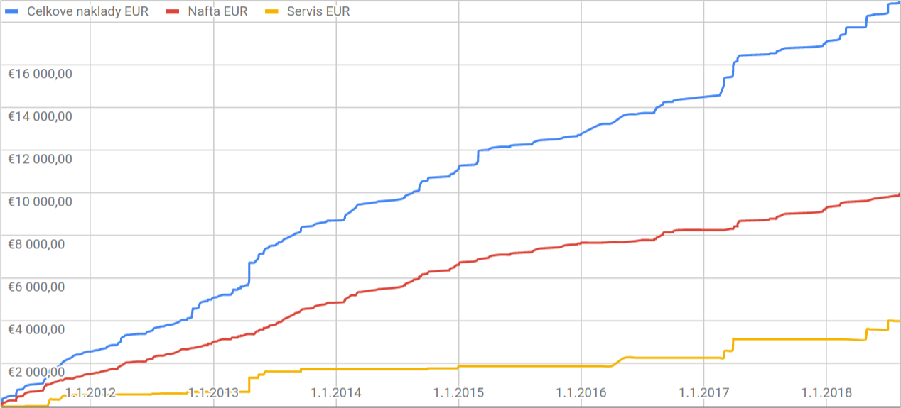

## Základné údaje

**Predajná cena:** 3100 EUR

**Kontakt:** viliam.simko zavináč gmail.com

- Výkon 110 kW (150 PS)
- Automatická prevodovka (5-stupňová)
- Zadný pohon
- Objem motoru 1995 cm³ (2 l)
- Strieborná metalíza
- **Rok výroby:** 2003
- **Najazdené:** 320000 km
- 4-dverové, 5-miestne

## Náklady na prevádzku auta
Všetky náklady spojené s vlastníctvom auta vediem v prehľadnej tabuľke.
Nasledujúci diagram znázorňuje akumulované náklady za tankovanú naftu,
servis a celkové náklady (vrátane postenia, parkovania a nákupu doplnkov).

* Moje náklady na servis auta boli priemerne 500 EUR za rok (pri nájazde 15-20000 km za rok)
* Náklady na palivo sú priemerne 7,8125 EUR na 100 km (približne 6,5 litrov na 100 km)

## Bezpečnosť
- ABS, ASR, DSC
- airbag spolujazdca, vodiča, okenné
- centrálne zamykanie

## Komfort
- original BMW palubá doska s rádiom + kazetovým prehrávačom + USB (cez kazetu)
- automatická klimatizácia
- posilňovač riadenia
- vyhrievané predné sedadlá
- elektrické okná 4x
- elektrické zrkadlá
- tónované predné sklá
- tmavé fólie na zadných oknách
- lakťová opierka

## Ďalšia výbava
- letné hliníkové disky orig. BMW
- 4x letné pneu Michelin
- zimné metalické disky + orig. BMW puklice
- 4x zimné pneu Continental WinterContact TS860
- zimné hmlovky
- odnímateľná deliaca mreža
- externá nabíjačka autobatérie

## Údržba vozidla + kalendár opráv
- auto parkované v podzemnej garáži
- auto jazdené väčšinu času na diaľniciach v DE, CZ, SK
- pravidelné výmeny oleja / filtrov každých 10000-12000 km
- každé dva roky výmena chladiacej kvapaliny do klimatizácie
- STK každé dva roky (naposledy 2019/03)
- ročná poistka na auto stojí 170 EUR
- tankovaný premium diesel + aditivum (Super Diesel Aditiv)

### rok 2011 (195 000 km, zmena vlastníka)
- nová automatická prevodovka (750 EUR)
- nový ventilátor chladenia (v prednej maske, 100 EUR)
- nové tlmiče
- nové brzdy
- výmena olejov - motor, hydraulika

### rok 2012
- nové brzdové doštičky 4x (40 EUR)
- výmena motorčeku na zadnom stierači (120 EUR)

### rok 2013
- inštalácia fólií na zadné okná (150 EUR)
- výmena predných ramien riadenia (320 EUR)
- čistenie ventilačnej jednotky turba (40 EUR)
- nové predné pružiny (150 EUR)
- olej, brzdová kvapalina (115 EUR)

### rok 2014
- nákup 2x letné pneu Michelin 205/55 R16 (230 EUR)

### rok 2015
- nový plech (kvôli škrabancom a viditeľnej korózii, 100 EUR)
- drobná oprava výfuku - zváranie argónom (50 EUR)

### rok 2016
- výmena oleja v automatickej prevodovke (200 EUR)
- nové brzdy a príslušenstvo 4x (400 EUR)

### rok 2017
- 2x zimné pneu Continental WinterContact TS860 (200 EUR)
  - 1. miesto: Test Autoklub CR 2016
  - 1. miesto: Test Autobild 2016
  - 1. miesto: Autoexpress 2016
- vymenené turbo (320 EUR)
- nastavenie vstrekovačov (protokol s výsledkami testu k dispozícii)
- nová batéria (90 EUR)
- nový posilovač bŕzd (200 EUR)
- nové silent-bloky (120 EUR)
- nové pružiny (100 EUR)
- výmena: olej, olejový filter, vzduchový filter

### rok 2018
- výmena drážkového remeňa (350 EUR)
- výmena predných ramien riadenia (300 EUR)
- výmena chladiacej zmesi v klimatizacii, dezinfekcia

### rok 2019
- STK
- oprava systému upevnenia ručnej brzdy (STK)
- nové predné svetlomety (100 EUR)
- nová riadiacia jednotka centrálneho zamykania (80 EUR)
- výmena: olej, olejový filter, vzduchový filter
- drobné opravy v rámci prípravy na predaj
- od Augusta 2019 auto stojí v garáži a čaká na budúceho majiteľa

## Známe vady, budúce opravy a údržba
- spätné zrkadlá sa nikdy nedali sklopiť, čo však nevadí ani v autoumývačke
- strešné okno sa mi zaseklo (jednoduchá oprava možná svojpomocne, nahradné diely max. 50 EUR)
- obnova kontaktov na vyhrievaní zadného okna (svojpomocne striebornou farbou)
- vadný kontakt na vyhrievaní sedadla u vodiča (treba rozobrať sedadlo a spojiť kontakty)
- zadné tlmiče - bežná údržba
- brzdové doštičky - bežná údržba
- olej, náplň klimatizácie - bežná údržba
- možno bude niekedy potrebné vymeniť zadné ložisko (30 EUR)

## Estetické vylepšenia
- drobná hrdza na pravom prednom blatníku (lokálne prebrusiť a prelakovať, alebo výmena celého kusu za nový 100-200 EUR)
- za cca 30 EUR za kus je možné vymeniť tesnenia na oknách u vodiča a spolujazdca (len kôli estetike)
  - BMW Schachtabdeckung aussen rechts Teilenummer: 51338194708
  - BMW Schachtabdeckung aussen links Teilenummer: 51338194707
